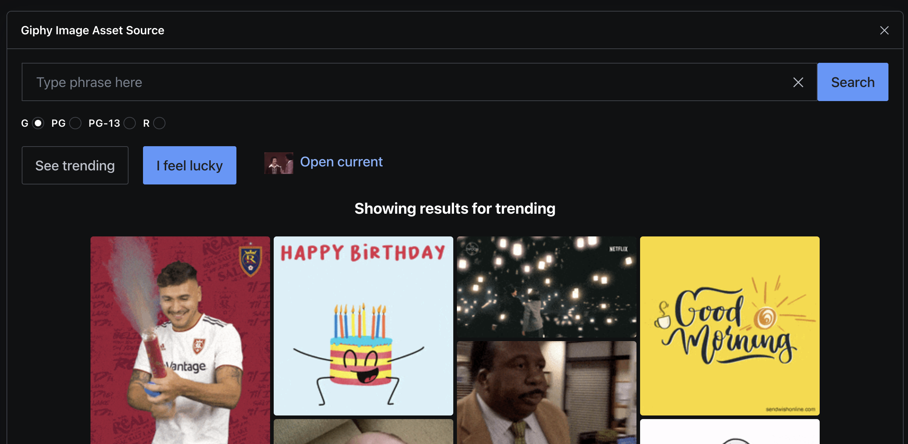
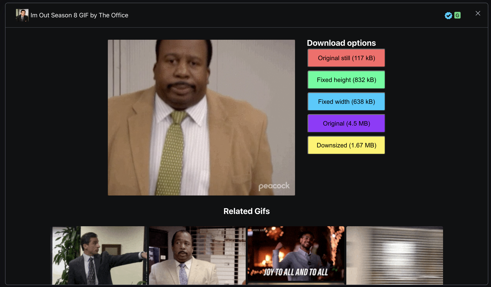

# sanity-plugin-asset-source-giphy

> **NOTE**
>
> This is the **Sanity Studio v3 version** of sanity-plugin-asset-source-giphy.

## What is it?

Plugin for [Sanity Studio](https://www.sanity.io) providing asset source for retrieving gifs from Giphy!



## Installation

In your studio folder, run:

```
npm install --save sanity-plugin-asset-source-giphy
```

or

```
yarn add sanity-plugin-asset-source-giphy
```

## Usage

Add it as a plugin in sanity.config.ts (or .js), with a valid [Giphy API key](https://developers.giphy.com/dashboard/?create=true):

**apiKey** is required, 

```js
import { giphyAssetSourcePlugin } from "sanity-plugin-asset-source-giphy";

export default createConfig({
  // ...
  plugins: [
    giphyAssetSourcePlugin({
      apiKey: "my-api-key"
    }),
  ],
});
```

## Changes since previous version
We made some changes as we wanted the plugin to feel more like 
giphy's own page. Therefore the old config to opt in to autoplay
of gifs is gone. In addition we now preview selected gif with related
gifs. All options are no longer available. It was way too much to explain
and most will only need a select few.



## Develop & test

Make sure to run `npm run build` once, then run

```bash
npm run link-watch
```

In another shell, `cd` to your test studio and run:

```bash
npx yalc add sanity-plugin-asset-source-giphy --link && yarn install
```

Now, changes in this repo will be automatically built and pushed to the studio,
triggering hotreload. Yalc avoids issues with react-hooks that are typical when using yarn/npm link.

### About build & watch

This plugin uses [@sanity/plugin-kit](https://github.com/sanity-io/plugin-kit)
with default configuration for build & watch scripts.
